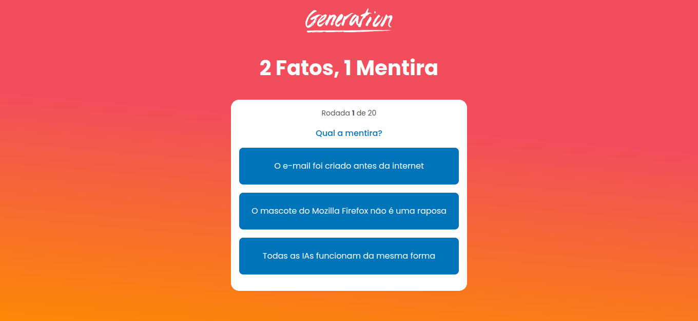

<div align="center" style="background: linear-gradient(5deg, #fc8905 0%, #f14d5c 60%); width: 100%;padding: .5rem 0;">

<h1 style="color: #fff; font-family:sans-serif">2 Fatos, 1 Mentira</h1>
</div>

<hr>

<p align="center">
   
</p>


### Tópicos 

- [Descrição do projeto](#descrição-do-projeto)

- [Aplicação](#aplicação)

- [Ferramentas utilizadas](#ferramentas-utilizadas)

- [Acesso ao projeto](#acesso-ao-projeto)

- [Abrir e rodar o projeto](#abrir-e-rodar-o-projeto)

- [Histórico de versões](#historico-de-versoes)

- [Desenvolvedores](#desenvolvedores)

## Descrição do projeto 

<p align="justify">
 
Este jogo apresenta três declarações relacionadas à tecnologia: duas são fatos verdadeiros e uma é falsa. Os jogadores são desafiados a identificar qual declaração é a falsa para ganhar pontos a cada acerto.

Desenvolvido como um projeto simples para inaugurar a abertura do bootcamp da Generation Brasil, está disponível para todes que desejam participar.


<br/>
</p>


## Ferramentas utilizadas

     
###

## Acesso ao projeto

https://quizgeneration.netlify.app/

Você pode [acessar o código fonte do projeto](https://github.com/jorgeguedess/game_quiz) ou [baixá-lo](https://github.com/jorgeguedess/game_quiz/archive/refs/heads/main.zip).


## Abrir e rodar o projeto

> Caso você seja um desenvolvedor, use as instruções abaixo para instalar as dependências e sugerir alterações para a aplicação.

É possível verificar o conteúdo de cada versão, selecionando a *branch* específica e o histórico de [commits].

Após baixar o projeto deste repositório, dentro do diretório do projeto você deve usar o comando `npm install` em um terminal, para gerar a pasta **node_modules**.
```sh
npm install
```
Concluída a instalação das dependências do projeto, use o comando `npm run dev` para visualizar a aplicação na porta [localhost:5173](http://localhost:5173).
```sh
npm run dev
```
A página irá recarregar a cada alteração feita no código e mostrará eventuais erros no console.

É recomendado que você use o comando `npm run build` antes de fazer um *commit*, para verficar a ocorrência de erros na aplicação e garantir o deploy da aplicação.
```sh
npm run build
```

## Historico de versoes

Clique nas versões abaixo, para observar a evolução do projeto ao longo do tempo.

| Versão | Update |
| ------ | ------ |
| [Versão 0.0](https://game-quiz-8w6qj4v32-jorgeguedes-projects.vercel.app/) | Primeira versão do projeto, apresentada no dia 19 de Março de 2024, quando foi publicado oficialmente o site ao ar. |


## Desenvolvedores

| [<br><sub>Jorge Guedes</sub>](https://github.com/jorgeguedess) | [<br><sub>Thaís Santos</sub>](https://github.com/thaissan)   |
| :---: | :---: |
